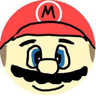

# Mario 9000 
Mario 9000 is a complete remake of the repository [Platformer](https://github.com/code_gauchos/Platformer) in hopes of making the current game better and to have more organized code.
### Goals:
- Create a platformer game with fully functioning collisions
- Create image a sound assets (in hopes that they will look good...)
- Create a in-game level editor
- Create an Arduino remote for input control that connects to the computer

### Third Party Libraries:
- [Kivy](https://kivy.org): Used for graphics, window creation, sound playing, etc.
- [PySerial](https://pypi.org/project/pyserial/): Used for communication with the Arduino remote.

Created with the help of <a href="https://codegauchos.com">Code Gauchos</a>.

